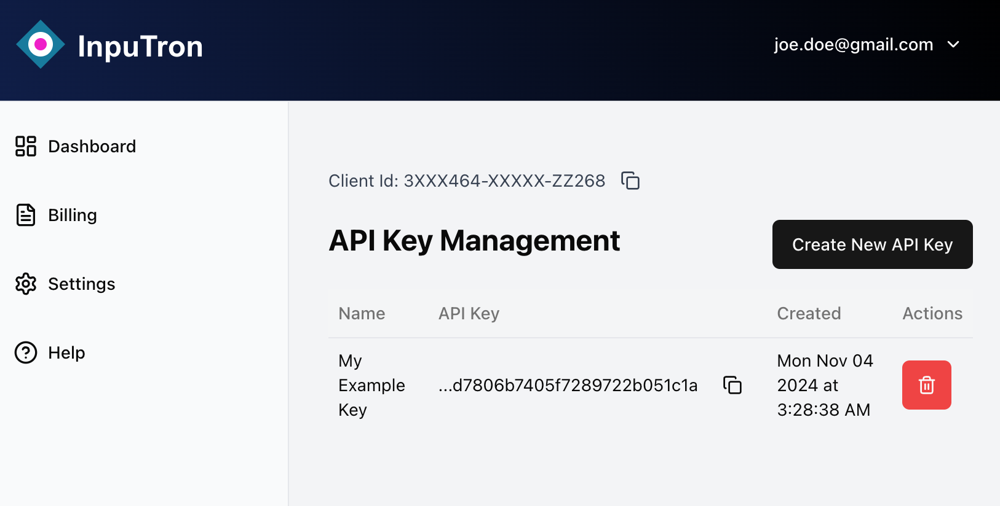

This is a [Next.js](https://nextjs.org) project that highlightes the different use cases of [inputron components](https://www.inputron.com)
## Getting Started
First, sign in to inputron.com to obtain a  Client ID and an to create an API Key.



Second, create a .env file and populate the following 

```plaintext
INPUTRON_API_KEY=
INPUTRON_ENGINE_API_ENDPOINT=https://api.inputron.com
INPUTRON_CLIENT_ID=
```

Lastly, run the development server:

```bash
npm run dev
# or
yarn dev
# or
pnpm dev
# or
bun dev
```

Open [http://localhost:3000](http://localhost:3000) with your browser to see the different examples of forms/applications that can be built using inputron components.


## Learn More

To learn more about Inputron, take a look at the following resources:

- [Inputron Documentation](https://inputron.com/docs) - learn about Inputron features and API.


